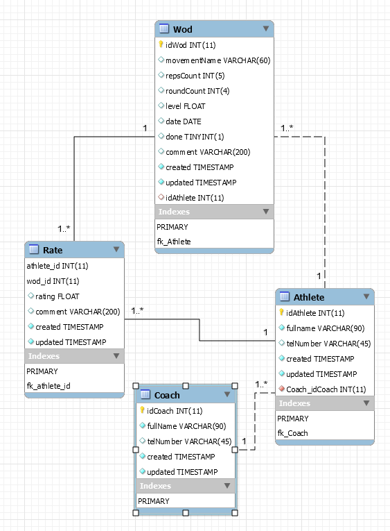

# Harjoitustyön raportti

[Harjoitustyön raportti](#harjoitustyönraportti)  
[Asennus](#asennus)  
[Kuvaruutukaappaukset ja toimintaperiaate](#kuvaruutukaappauksetjatoimintaperiaate)  
[Ohjelma tarvitsemat ja mukana tulevat resurssit](#ohjelmatarvitsematjamukanatulevatresurssit)  
[Tiedossa olevat ongelmat](#tiedossaolevatongelmat)  
[Jatkokehitys](#jatkokehitys)  
[Haasteet ja opittua](#haasteetjaopittua)  
[Ehdotus arvosanaksi](#ehdotusarvosanaksi)  
  
## Asennus

Ohjelma käyttää 
- Entity Framework versiota 8.0.19 (MySql.Data.EntityFramework Version 8.0.19),  
- MySqlClient versiota 8.0.19 (MySql.Data Version 8.0.19) sekä  
- MaterialDesignThemes teemakirjastoa (MaterialDesignThemes).  
- Ulkoista MySql tietokantaa (ip:134.122.91.6)

## Tietoja ohjelmasta

WodCoach ohjelma on tarkoitettu käytettäväksi valmentajien ja urheilijoiden välisessä valmennussuhteessa. Ohjelmassa valmentaja voi luoda valmennettavalle päivittäisiä treenejä ja urheilija voi katsoa niitä tahollaan. 

Treenin tehtyään urheilija voi merkitä liikkeet tehdyiksi sekä arvostella ja kommentoida niitä. Valmentaja näkee urheilijan tekemät treenit. Urheilijoita ja liikkeitä voidaan ylläpitää ohjelmassa. 

### Toiminnalliset vaatimukset
|Vaatimus| Kuvaus  | Toteutettu| 
|:--|:--|:----:|
|Urheilijoiden CRUD | Valmentaja voi lisätä, poistaa, listata ja päivittää urheilijoita| Kyllä |  
|Treenien CRUD| Valmentaja voi lisätä, poistaa, listata ja päivittää treenejä urheilijoille | Kyllä|
|Kommenttien listaus treeneittäin| Valmentaja voi lukea valmennettavan kommentit treenistä | Ei |
|Treenin tilan näyttäminen| Valmentaja voi nähdä onko treeni suoritettu | Kyllä |
|Treenien listaus päivittäin ja henkilöittäin| Urheilija voi listata eri päivien treenejä, merkitä tehdyksi ja kommentoida | Kyllä |
|Treenin arvostelu| Urheilija voi arvostella päivän treenin | Kyllä |

### Toiminnalliset vaatimukset / ylitetty
|Vaatimus| Kuvaus  | Toteutettu| 
|:--|:--|:--:|
|Treenin lisäys | Valmentaja voi määrittää yksittäiselle liikkeelle vaikeustason| Kyllä |

### Eitoiminnalliset vaatimukset
|Vaatimus| Kuvaus  | Toteutettu| 
|:--|:--|:--:|
|Poikkeusten käsittely | Poikkeukset ja virheet tulee olla käsitelty, jotta ohjelma ei kaadu| Kyllä |  
|SQLinjektio estetty | SQLinjektio täytyy olla estetty| Kyllä, Entity Framework | 
|Salasanojen kryptaus | Salasanojen tulee olla kryptattu| Kyllä |
|Lähdekoodin kommentointi | Lähdekoodin tulee olla kommentoitu| Kyllä |  

## Kuvaruutukaappaukset ja toimintaperiaate  
### Aloitussivu
 
    1. Urheilija valitsee tämän
    2. Valmentajan valitsee tämän  
  
### Valikko
  
    1. Valinnat, jotka ovat valittavissa, jos valitaan alussa Athlete
    2. Valinnat, jotka ovat näkyvissä, mutta valittavissa ainoastaan, jos valitaan Coach.  

### Valmentajan sivu
 
    1. ComboBox urheilijan valitsemiseksi
    2. DatePicker päivämäärän valitsemiseksi
    3. Combobox valmiin liikkeen valitsemiseksi, tähän voi kirjoittaa myös oman
    4. Toisto ja kierroslukumäärät
    5. Valmentajan lisäinfo liikkettä varten
    6. Valmentajan arvio liikkeen vaikeudesta. Tämä päivittyy, mikäli valitaan aiempi liike comboboxista.
    7. Liikeen poistaminen ja tallennus
    8. Datagrid, jossa tallennetut liikkeet näkyvät. Klikkauksella datagridissä textboxien tiedot päivittyvät ja liikkeitä voi päivittää. 
    9. Jokaisen sivun alalaidassa on inforuutu, jossa näytetään olennaista tietoa tapahtumista.

### Urheilijan sivu
  
    1. Urheilijan ja päivämäärän valinnat samoin kuin Coach sivulla.
    2. Label teksti, joka päivittyy, jos datagridiltä valitaan jokin liike.
    3. Urheilija voi kommentoida yksittäistä liikettä ja 
    4. antaa arvosanan liikkeelle. 
    5. Rate napilla arvostelu tallentuu
    6. Datagridille tulostuu urheilijan kyseisen päivän treenit, jotka valmentaja on hänelle luonut.
    7. Urheilija voi merkitä liikkeen suoritetuksi checkboxilla

### Liikkeiden hallinta sivu
  
    1. Textbox teksti, joka päivittyy, jos datagridiltä valitaan jokin liike., jonka jälkeen liikettä voi muokata. Tähän voi kirjoittaa myös uuden liikkeen ja tallentaa.
    2. Liikeelle voi antaa vaikeustason
    3. Poisto ja tallennusnapit
    4. Datagridille tulostuvat kaikki liikkeet. Mikäli kahdella urheilijalla on saman niminen liike, tulostuu liike kahdesti. 

### Urheilijoiden hallinta sivu
  
    1. Textboxit, joihin voi syöttää uuden urheilijan tiedot. Kentät päivittyvät datagridistä klikatun urheilijan tiedoilla, jonka jälkeen niitä voi muokata. 
    2. Urheilijalle valitaan valmentaja, jolloin valmentajanumero päivittyy kentä oikealla puolella olevaan textboxiin. 
    3. Datagridiin tulostuu urheilijoiden tiedot
    4. Urheilijan poistaminen vaatii vahvistuksen erillisessä ikkunassa (ei kuvassa)

## Ohjelma tarvitsemat ja mukana tulevat resurssit
Ohjelma tarvitsee toimiakseen ulkopuolista tietokantaa. WodCoach ohjelma käyttää omalle palvelimelle luotua tietokantaa (ip: 134.122.91.6), jonka käyttäjätunnus sekä salasana on salattuna ohjelman sisällä app.config tiedostossa. 
Tietokannassa on valmiiksi harjoitustyön palautushetkellä dataa, eikä sitä tarvitse lisätä. Tietokannan [luontiskripti](../Scripts/WODCoach_Creation_Script.sql). 
Alussa käytetty taustakuva kulkee ohjelman mukana. 

### Tietokantakaavio

## Tiedossa olevat ongelmat
**Coach sivulla ei voi nähdä urheilijan antamaa kommenttia tai arvosanaa treenille.**
* Olion "Rate" ominaisuuksien yhdistäminen samaan datagridiin yhdessä olion "Wod" ominaisuuksien kanssa ei onnistunut huolimatta pitkästä yrittämisestä. On todennäköistä, että toiminto tulisi tehdä jollain muulla tapaa. Tämän vuoksi toiminnallisuus, jossa valmentaja voi lukea urheilijoiden kommentit treenien yhteydestä ei toteutunut.  

**Sivun vaihtumisessa on viivettä.** 
* Tuntemattomasta syystä sivujen latautumisessa on viivettä. Todennäköisesti viive liittyy tietokantahakuun. 

**Datagridin valinnan poistaminen**
* Kun datagridiltä on valinnut objektin, valintaa ei saa pois muutoin kuin esimerkiksi tallentamalla saman objektin uudelleen. Tämä hoituisi uudella napilla. 

## Jatkokehitys
**Käyttäjäkohtainen näkymä** puuttuu tällä hetkellä. Alkuun tulisi luoda sisäänkirjautuminen, jonka jälkeen urheilija voisi nähdä ainoastaan omat treeninsä, sama voisi päteä myös valmentajaan.  

**Valmentajien hallintasivua** ei luotu tässä vaiheessa, vaikkei sen luominen toisaalta ole kovin iso toimenpide. 

Yksi vaihtoehto **urheilijoiden arvosteluiden näyttämiseen** olisi luoda niille oma **sivu**. Toisaalta olisi mielekästä myös luoda koko päivän treenille oma arvosanansa yksittäisen liikkeen sijaan.

## Haasteet ja opittua
Oppimista tuli paljon **erityisesti Entity Frameworkin käytön osalta**. EF:llä on sinänsä helppoa toimia tietokannan suuntaan, mutta se vaatii opettelua. Harjoitustyössä lähes kaikki, mikä liittyi entity framework:iin ja tiedon hakemiseen tietokannasta, täytyi selvittää erikseen. Kaikki tuli kyllä selvitettyä, joten oppimista tapahtui.  

**App.configin "connectionStrings" osion salaaminen** onnistui lopulta helposti suoraan Visual Stuodion kehittäjän komentokehotteesta, vaikka jälleen ohjeen etsimisessä kuluikin aikaa. Samalla opin, kuinka app.config toimii sovellusta buildatessa.  

**MVVM mallin käyttökin** selvisi pääpiirteittäin lopulta. Aluksi EF tuotti tässäkin päänvaivaa, mutta lopulta luulen ymmärtäneeni kuinka tiedostot kansioihin tulee sijoittaa ja minkä tulee tehdä mitäkin.  

Harjoitustyössä oli tarkoitus harjoitella myös **Material Design teemakirjaston käyttöä**. Tässä onnistuttiinkin ja teemakirjastoa käytettiin joissain ohjelman komponenteissa. Laajempi käyttö vaatii kuitenkin vielä harjoittelua ja ennen kaikkea teemakirjaston tuntemusta.  

**Sidonnan** käyttö tuli tutuksi ja opin muun muassa kuinka sidonta tehdään useammastakin luokasta.

### Haasteita

Suurin yksittäinen haaste oli yrittää saada **kahden tietokantataulun tietoja yhteen datagridiin**, eikä siinä onnistuttukaan.

Toinen haaste oli kokonaisuuden kannalta **Entity Framework, sen soveltaminen ja sovittaminen MVVMmalliin**. Lopulta soveltaminen onnistui melko hyvin ja sovittaminen MVVMmalliinkin mielestäni pääosin.

## Ehdotus arvosanaksi

Oman käsitykseni mukaan harjoitustyössä käytettiin laajasti kurssilla käsiteltyjä aiheita. Käyttöliittymä on toimiva, joskin kyseinen ohjelma olisi parempi webpohjaisessa käyttöliittymässä. Valinta oli kuitenkin tietoinen, koska tarkoitus oli jalostaa ideaa ja tehdä myöhemmin vastaaava webympäristössä. 

Ohjelmiston tueksi luotiin oma tietokantapalvelin ja erityisesti entity framwork:iä tutkittiin laajasti. Samalla tutustuttiin myös ulkoiseen MaterialDesign teemakirjastoon. 

Ulkoasun suunnitteluakin tehtiin, tosin myöhemmin suunnitelmaa jouduttiin korjaamaan ja samalla tietenkin tuli oppia. Ulkoasun lopputulos on siedettävä, mutta parantamisen varaa on. 

Kurssin aihealueen ja opittujen asioiden laajuuden sekä harjoitustyöhön käytetyn ajan huomioiden ehdotan arvosanaksi 4,5.

